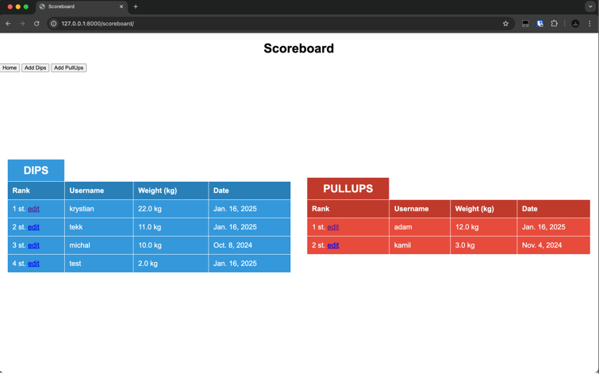
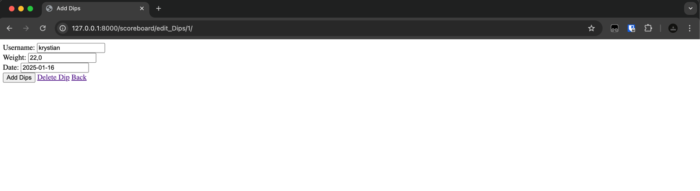

# GravityWarriors 🌟

GravityWarriors is a Django-based web application designed for our calisthenics team. The platform serves as a centralized hub to showcase team member profiles and maintain a **scoreboard** for the most impressive **weighted Dips** and **Pull-ups** achievements. The app ensures smooth functionality for managing users and their performance records while supporting add, edit, and delete actions with proper permissions.

---

## 🌍 Project Goals

- **Team Management**: Provide a platform for GravityWarriors teammates to manage their profiles.
- **Dynamic Scoreboard**: Highlight the best performances in **Dips** and **Pull-ups** with a live scoreboard.
- **Permission-Based Editing**: Ensure that only authorized users can add, edit, or delete data in the scoreboard.
- **Stability & Scalability**: Build a reliable, extensible application for future enhancements.

---

## 🔧 Features

### Currently Implemented
1. **Scoreboard**  
   - Fully functional **Dips** and **Pull-ups** scoreboard.  
   - Ability to **add**, **edit**, and **delete** entries.  

2. **Responsive UI**  
   - User-friendly interface with clear visibility for rankings and achievements.  

### In Progress
- **Login and User System**: Currently, the app does not have login or user protection.  
- **User Profiles**: The next step is to create a user system that associates each teammate with their own profile.  
- **Authentication and Permissions**: Add a secure login system to protect scoreboard modifications and restrict access to authorized users.  

---

## 🛠️ Technology Stack

- **Backend**: Django Framework  
- **Frontend**: HTML, CSS  
- **Database**: SQLite (default for development)  
- **Version Control**: Git  

---
## Example Usage

The scoreboard allows you to display a list of scores and manage the entries. Below, you will find instructions on how to interact with the scoreboard, as well as images illustrating the interface.

### View Scoreboard

Here is an example of how the scoreboard looks when you view it:



### Add, Edit, and Delete Score Entries

The scoreboard allows you to manage entries through a modal. You can add a new entry, edit an existing one, or delete an entry from the scoreboard. Below is a screenshot of the modal used for managing the scoreboard:


## 🚀 Installation

1. Clone the repository:
   ```bash
   git clone https://github.com/yourusername/GravityWarriors.git
   cd GravityWarriors
